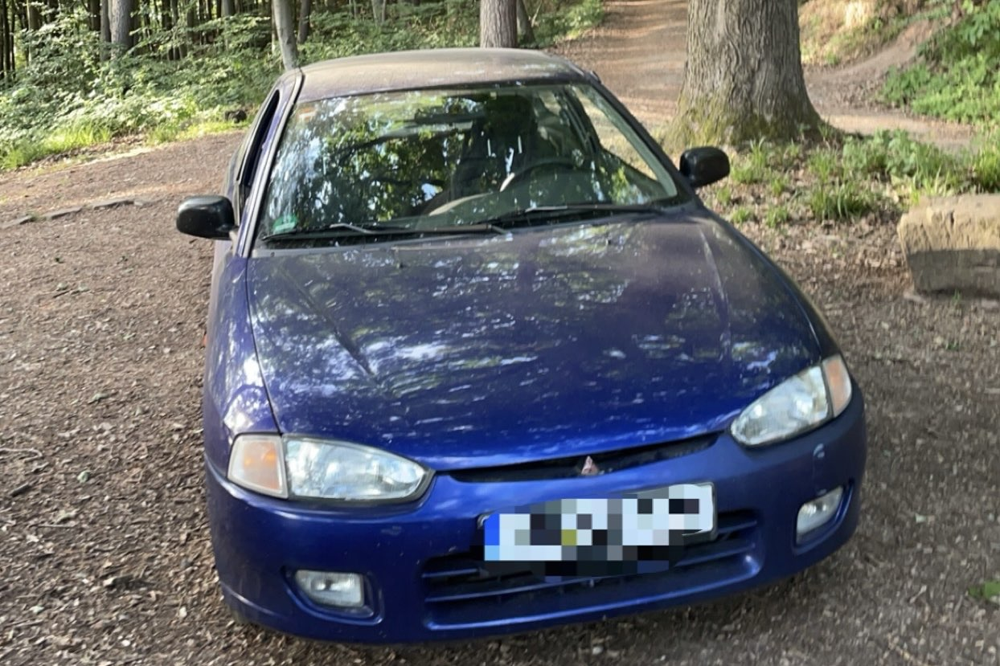

# Car

Controlling car functions remotely

This uses an old android phone as hub which connects via BLE to chips controlling functions such as:

- Ignition (remote start, assuming engine immobiliser reports OK)
- windows
- door lock

